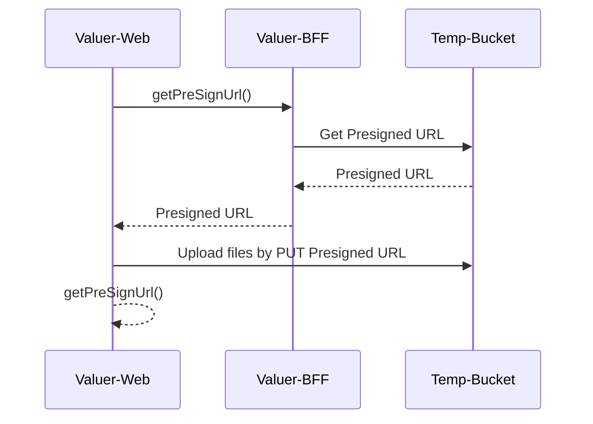

```mermaid
sequenceDiagram
	participant Valuer-Web
	participant Valuer-BFF
	participant Temp-Bucket
	Valuer-Web->>Valuer-BFF:getPreSignUrl()
	Valuer-BFF->>Temp-Bucket:Get Presigned URL
	Temp-Bucket-->>Valuer-BFF:Presigned URL
	Valuer-BFF-->>Valuer-Web:Presigned URL
	Valuer-Web->>Temp-Bucket:Upload files by PUT Presigned URL
	Valuer-Web-->>Valuer-Web:getPreSignUrl()
```
Assumption in this spike:
1. We assumed that we will upload file with a fixed name call **upload_files.pdf**
2. We assumed that we will upload file to **demo-file-download** bucket in this demo