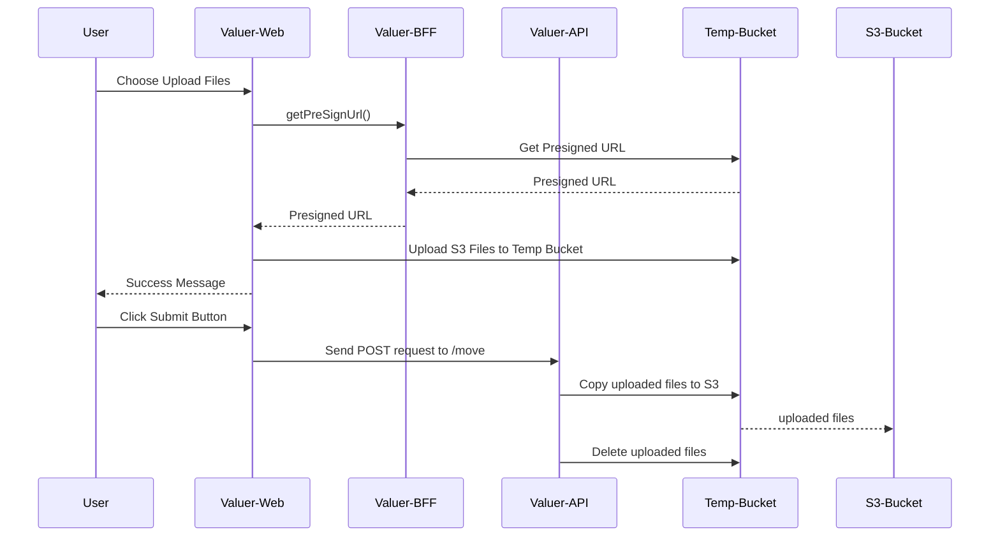

Further Works After Spike: 
1. The infras have only test environment and no pipeline has built yet, a new ticket will be created for this if needed
2. In this demo we assumed that we will upload a file per operation, should further support multiple files upload in further development

