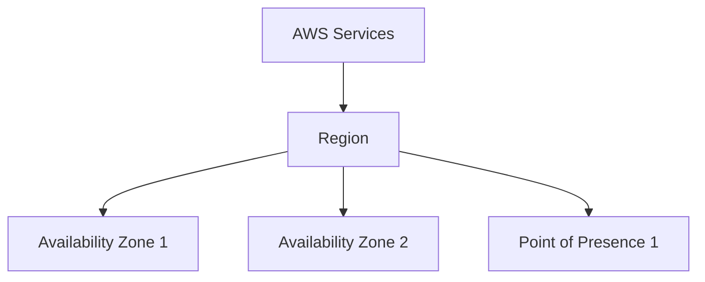

# Hierarchy Graph
---

* Region
	* **a cluster of data centers**. Most AWS service is region-scoped
	* E.g. us-west-1, eu-west-3
* Availability Zone
	* one or more discrete data centers with redundant power, networking (high bandwidth & ultra low latency) & connectivity, so that it could **be isolated from disaster**
	* Each region has **3-6** Availability Zones
	* E.g. ap-southeast-2a, ap-southeast-2b
* Point of Presence
	* **Edge Locations** and **regional caches** to lower the latency to end users

# Choose your AWS Regions
---

1. Compliance with **legal requirements** and **data governance** for special region
2. **Proximity/latency** to customers
3. **Available Services** provided to special region
4. **Pricing** for AWS Services in that region