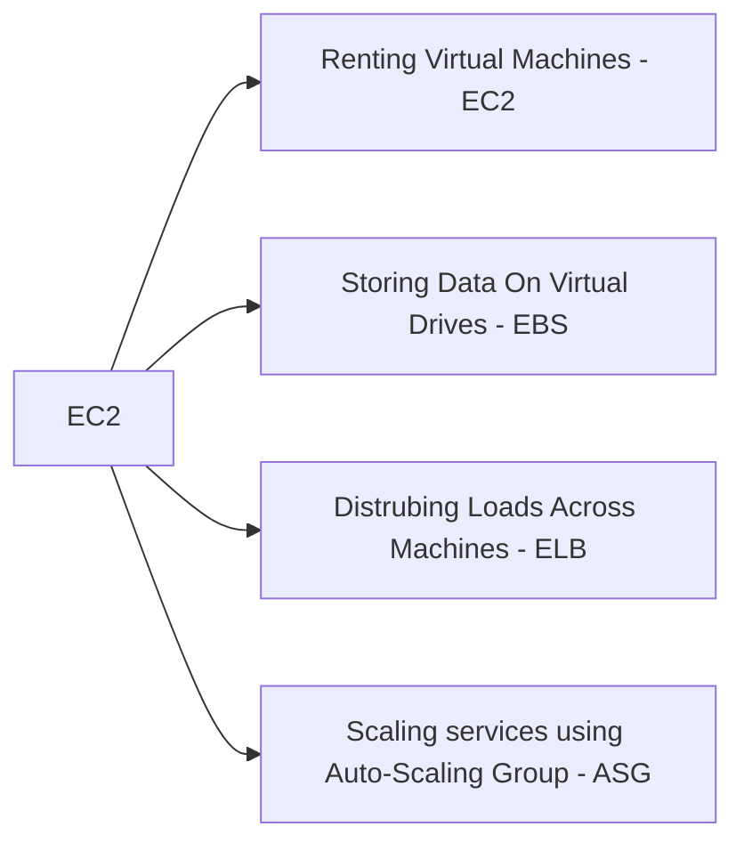

# What is EC2
---
EC2 stands for **Elastic Computing Cloud**. It's a popular AWS offering that provides Infrastructure as a Service (IaaS) or virtual machines. It includes the capability of: 

# EC2 Sizing & Configurations
---

* Operation System: **Linux**, **Windows** & **MacOS**
* CPU & RAM
* Storage
	* Network-Attached: **EBS & EFS**
	* Hardware: **EC2 Instance Store / SSD**
* Network Card: Speed, Public IP address
* Firewall Rules: [[03 Security Groups|Security Groups]]
* Bootstrap Script (Set up only at the first launch of a instance): EC2 User Data Script
	* Launching command **when a machine starts**
	* Automating boot tasks (E.g. Installing updates, softwares, Downloading files from Internets)

# EC2 Instance Types: Example
---

[[02 Instance Types |Instance Types]]

# Connectivity
---

* **SSH** (**CLI Tools for remote machine**, Accessible at Mac/Linux/Windows > 10)
	* Examples
	![[ssh.png]]
* **PuTTY** (**CLI Tools for remote machine**, Accessible at Windows)
* **EC2 Instance Connect** (**CLI Tools in AWS Management Console**, All Operation Systems)

# Best Practice
---

* **Never** add your aws configuration into your instance and Instead using [[001 Introduction#Roles|EC2 Instance IAM Role]] (Otherwise user in the same account can see it)