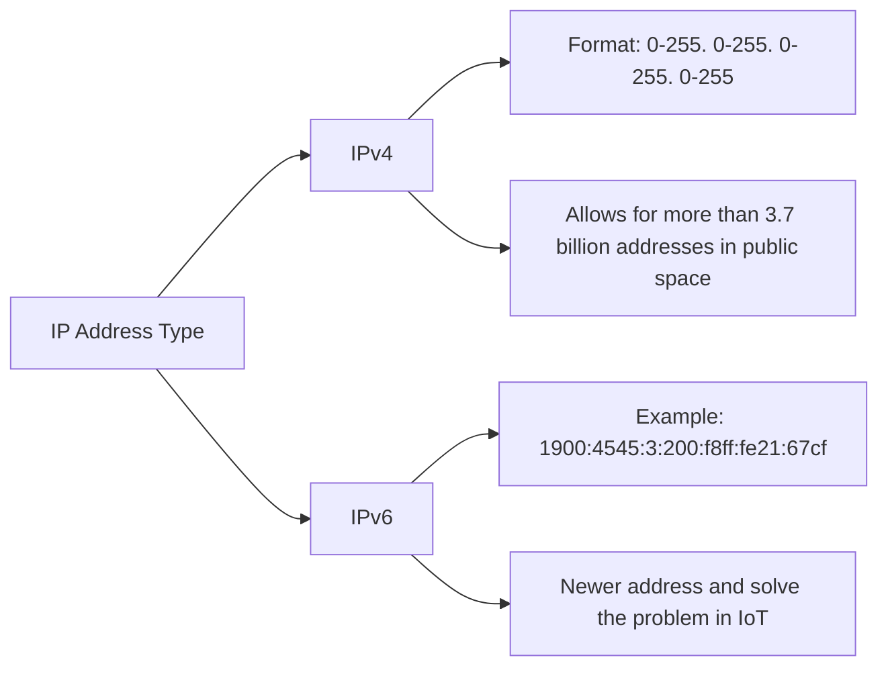

# IP Address 
---

**Type:** IPv4 vs IPv6 (IPv4 is more common used)

# Public IP vs Private IP
---

| Public IP | Private IP |
| --- | ---|
| Can be identified in **Public** | Only identified in **private network**|
| Should be **unique** across whole web | Should be **unique in same private network** but can be **the same in different private network**|
| **Most IPs** can be used as Public IP & Can be **geo-located** easily | Only **a specified range of IPs** can be used as Private IP|

Private Machine Connect to Public Web (WWW): Using **NAT + Internet gateway (Proxy)**

# EC2 Elastic IP
---

* Definition: **a public IPv4 IP for one EC2 instance**, which could own **as long as you don't delete it**. (By Default, EC2 will change Public IP after stop and start instances)
* Characteristics
	* You can have only **5 Elastic IPs** for an account (Or you can ask AWS to increase that)

## Suggestions on Elastic IP
---
* Avoid Using Elastic IP because:
	* They usually lead to **poor architectural decisions**
	* The failure of an instance or software could be masked by rapidly **remapping your Elastic IP address** to another instance in the same account
* Suggestion Way
	* Use random IP and **register DNS name** to it
	* Use **Elastic Load Balancer** (ELB)

# Elastic Network Interface (ENI)
---

Definition: A logical component in a VPC that represent as a **virtual network card** which can have the following technical attributes:
* **Private IPv4** or an extra **secondary Private IPv4**
* One **Elastic IP** per private IPv4
* One **MAC address**
* One **Public IPv4**
* Can be attached to one or more **security groups**

Characteristics:
* It's bound to a specific **availability zone**
* It's usually been use to **treat a network failover** by creating the ENI independently and attach/move them between EC2 instances
![[vpc_multi_vif_arch_2.png]]