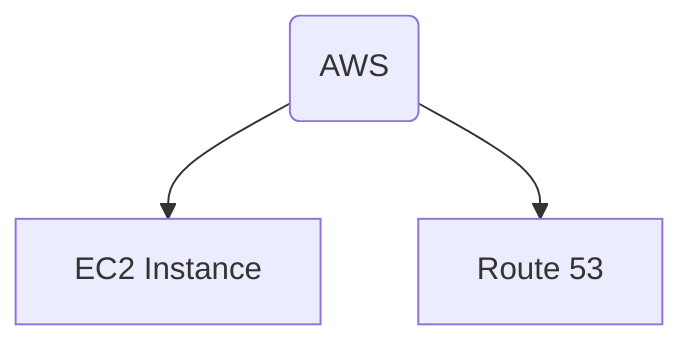

## 什么是双链

---

如图所示，AWS与EC2 Instance和Route 53建立了链接，因此我们可以得出结论，AWS为EC2 Instance和Route 53提供了**出链**，AWS自身为EC2 Instance和Route 53的**入链**

## 双链的意义
---

建立知识网络，管理知识片段 (复用已有知识)。

## Obsidian的链接方式
---

1. 直接链接文章 (Example: [[Sample Document]]) 
	1. 按住Command键 (Win为Ctrl)之后可以鼠标光标移动到链接上，可以实现文章内容实时预览
2. 链接到文章的某一个章节 (Example: [[Sample Document#02]])
3. 链接到文章的一个具体的段落 (Example: [[Sample Document#^49424c]])
	1. 编号可以自定义 (在后面空格加入^号输入编号即可，E.g.[[Sample Document#^zeekrx]])
	2. 可以为这个段落添加别名 (在链接后面输入|号并在后面加入标题即可, E.g. [[Sample Document#^zeekrx|极氪X]])
4. 显示Obsidian链接的内容，需要在我们的链接前面加一个感叹号，Example:
	1. ![[Sample Document#02]]
5. 